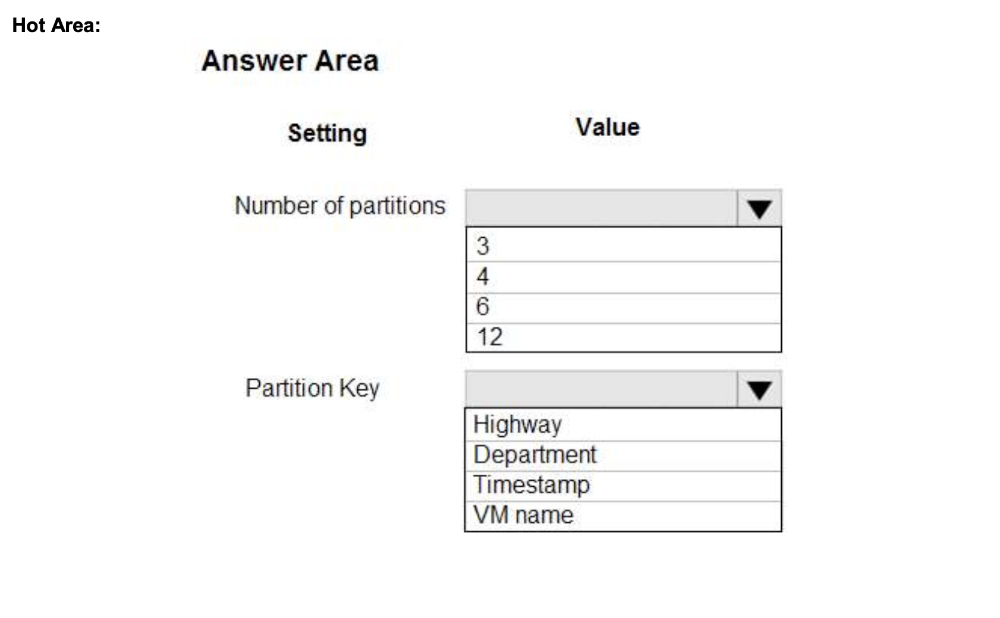
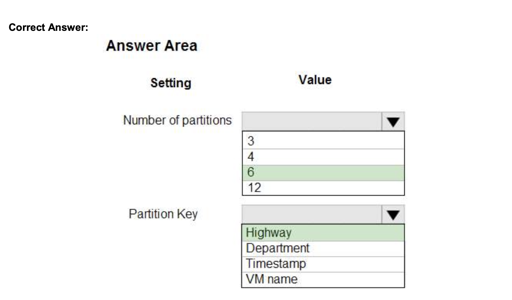
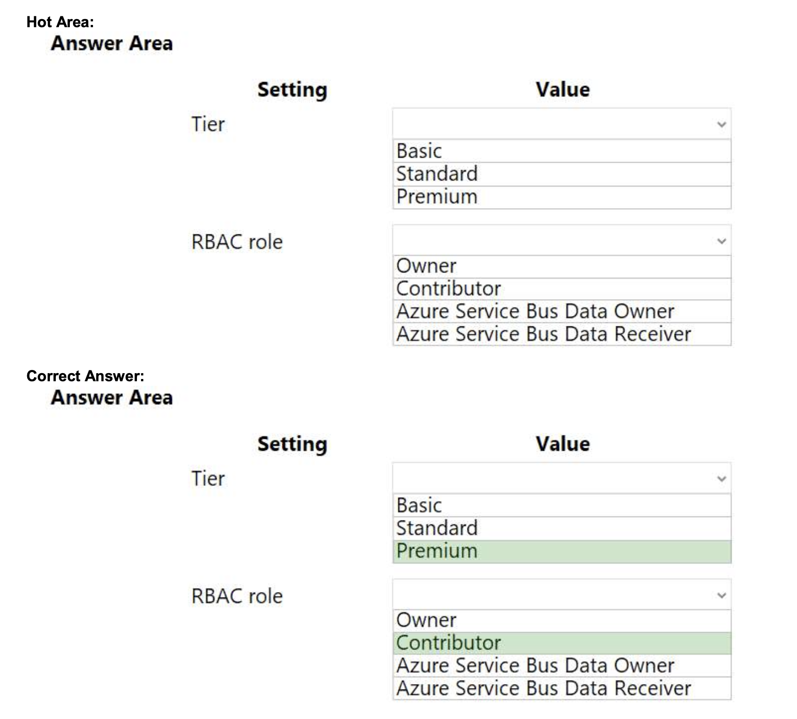

## Tema 4: Implement containerized solutions
### Preguntas:
- ¿Cuál es la diferencia entre Azure Container Registry, Azure Container Instances y Azure Container Apps?
  
      Azure Container Registry es un lugar para almacenar y administrar imágenes de contenedores, Azure Container Instances es un servicio para ejecutar contenedores individuales de manera rápida y sencilla, y Azure Container Apps es una plataforma de orquestación de contenedores para ejecutar aplicaciones complejas compuestas por múltiples contenedores.
  
- ¿Cómo se utiliza Azure Container Registry para almacenar y gestionar imágenes de contenedores?
  
      Para almacenar imágenes de contenedores en Azure Container Registry, primero debes crear un registro en el portal de Azure. Luego, puedes utilizar herramientas como Docker para construir y etiquetar tus imágenes de contenedores localmente. Después de eso, puedes utilizar comandos como docker push para enviar las imágenes al registro de Azure Container Registry.

      Para gestionar imágenes de contenedores en Azure Container Registry, puedes organizarlas en repositorios para mantenerlas ordenadas y etiquetarlas con versiones. Además, puedes administrar el acceso a las imágenes estableciendo permisos y roles para controlar quién puede ver y modificar las imágenes almacenadas en el registro.

- ¿Cuál es el propósito y la ventaja de utilizar Azure Container Instances para ejecutar contenedores sin necesidad de administrar una infraestructura subyacente?

      El propósito de Azure Container Instances es permitir la ejecución de contenedores sin tener que preocuparse por administrar la infraestructura subyacente. La ventaja principal es la simplicidad, ya que no se requiere configurar ni administrar clústeres de contenedores o máquinas virtuales. Además, ofrece escalabilidad, flexibilidad y costos optimizados al pagar solo por el tiempo en que los contenedores están en ejecución.

### Identificar y explicar (comprobar si es posible) de la batería de Preguntas 3 preguntas por cada integrante relacionadas con Azure container registry y Azure Event Instance y Azure Container Apps
- QUESTION 3, p.: 83
  
  HOTSPOT

    You are building a traffic monitoring system that monitors traffic along six highways. The system produces time series analysis-based reports for each highway. Data from traffic sensors are stored in Azure Event Hub.

    Traffic data is consumed by four departments. Each department has an Azure Web App that displays the time series-based reports and contains a WebJob that processes the incoming data from Event Hub. All Web Apps run on App Service Plans with three instances.

    Data throughput must be maximized. Latency must be minimized.

    You need to implement the Azure Event Hub.

    Which settings should you use? To answer, select the appropriate options in the answer area. 
    
    NOTE: Each correct selection is worth one point.

    
    

    Explicación:
     
      El número de particiones se establece en 6 durante la creación. Esto significa que la entidad o recurso en discusión se divide en 6 partes más pequeñas para su gestión. En este caso, se menciona que hay 6 autopistas, lo que sugiere que cada partición puede representar una autopista individual.

- QUESTION 15, p.: 104
    
      You are developing an Azure solution to collect point-of-sale (POS) device data from 2,000 stores located throughout the world. A single device can produce 2 megabytes (MB) of data every 24 hours. Each store location has one to five devices that send data.
      
      You must store the device data in Azure Blob storage. Device data must be correlated based on a device identifier. Additional stores are expected to open in the future.
      
      You need to implement a solution to receive the device data.
      
      Solution: Provision an Azure Event Grid. Configure the machine identifier as the partition key and enable capture.
      
      Does the solution meet the goal?
      A. Yes 
      B. No

      Correct Answer: A

    Explicación:
    
      La solución propuesta con Azure Event Grid cumple el objetivo al permitir recibir y enrutar los eventos de los dispositivos de punto de venta. La configuración del identificador de la máquina como clave de partición garantiza el almacenamiento y procesamiento conjunto de los datos de cada dispositivo. Además, al habilitar la captura en Event Grid, los datos se guardan en Azure Blob Storage para su análisis y procesamiento posterior.

- QUESTION 6, p.: 133

       HOTSPOT
       
       You need to configure Azure Service Bus to Event Grid integration.
       
       Which Azure Service Bus settings should you use? To answer, select the appropriate options in the answer area.
       
       NOTE: Each correct selection is worth one point.
    

    Explicación:
    
      Service Bus ahora tiene la capacidad de emitir eventos a Event Grid cuando hay mensajes en una cola o suscripción, pero no hay receptores presentes. Esto permite que Event Grid y Service Bus trabajen juntos de manera más eficiente. Para habilitar esta función, se requiere un espacio de nombres de Service Bus Premium con al menos una cola o tema, y acceso de colaborador al espacio de nombres de Service Bus para configurar la integración adecuada entre los dos servicios.
